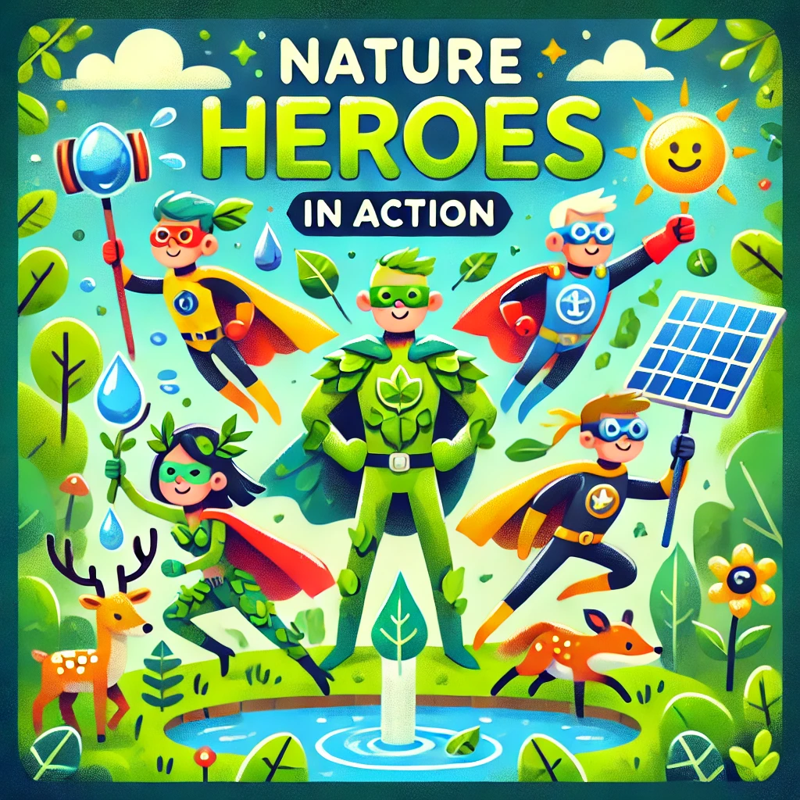

<a href="https://open.spotify.com/episode/4U0W02g862qXRzNsFiWrWP?si=MCGpMwOpSeyyep-5pvs-EA">
    Preview do podcast

# Projeto Podcast Gerado por I.A.s

Projeto com o objetivo de gerar um podcast utilizando ferramentas de IA através de prompts mais trabalhados.

Utilizer uma esteira de prompts para gerar cada etapa do processo criativo.

## 💻 Tecnologias utilizadas no projeto

- [ChatGPT](https://chat.openai.com/) 
- [NaturalReader](https://www.naturalreaders.com/)
- [Capcut](https://www.capcut.com/pt-br/)

## ✨ Como foi feito?

- Roteiro gerado via ChatGPT
- Audio gerado pela NaturalReader
- Chatgpt Para gerar capas
- Capcut para tratar aúdio e adicionar sons de fundo

## 👩🏻‍💻 Expert

    
    
&nbsp&nbsp&nbspJesse Rocha 
    &nbsp&nbsp&nbsp
    <a href="https://github.com/jessetiago03">
    GitHub</a>&nbsp;|&nbsp;
    <a href="http://linkedin.com/in/jesse-rocha-">LinkedIn</a>

  

---

⌨️ com 💖 por [Jesse Rocha](https://github.com/jessetiago03)
